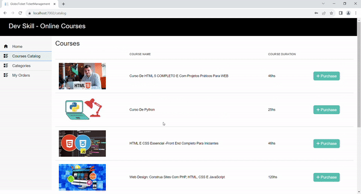
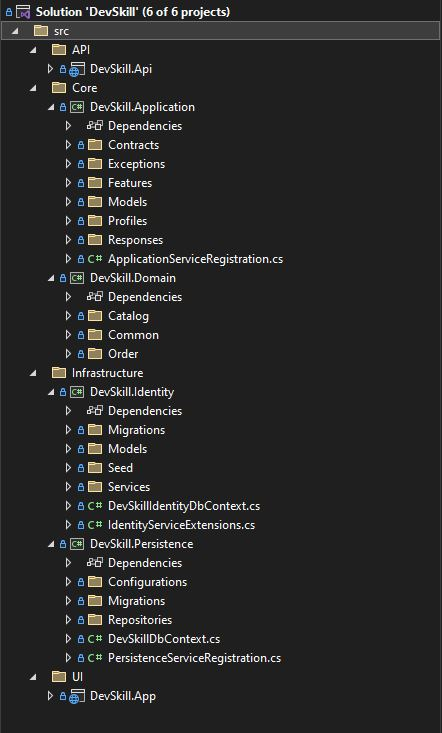

# DevSkill - Projeto do Tech Challenge

O DevSkill é um projeto desenvolvido como parte do Tech Challenge  do Curso de Pós-Graduação em Arquitetura de Sistemas .Net com Azure. O Tech Challenge é um projeto que abrange os conhecimentos adquiridos em todas as disciplinas desta fase.

## Sobre o Projeto

O tema escolhido para este projeto é um sistema de E-commerce para a venda de cursos online. O sistema oferece um catálogo de cursos que foram divididos em categorias, incluindo:

- Web Development
- Mobile
- Data Science

Os usuários têm a capacidade de navegar pelo catálogo de cursos, selecionar um curso de seu interesse e emitir uma ordem de compra. Para concluir uma ordem de compra, o usuário precisa fornecer informações do cartão de crédito. No entanto, para utilizar esse recurso, é necessário se registrar na plataforma criando um perfil de usuário com um nome de usuário e senha. Os detalhes do processo são os seguintes:

1. **Navegação no Catálogo de Cursos**: Os usuários podem explorar cursos disponíveis nas categorias listadas.

2. **Seleção de Curso**: Após encontrar um curso desejado, o usuário pode selecioná-lo para obter mais informações.

3. **Emissão de Ordem de Compra**: O usuário pode emitir uma ordem de compra para o curso selecionado, fornecendo as informações necessárias do cartão de crédito.

4. **Registro de Usuário**: Para emitir ordens de compra, o usuário deve se registrar na plataforma. Isso envolve a criação de um perfil de usuário com um nome de usuário e senha.

5. **Login**: Após o registro, o usuário pode fazer login em sua conta para acessar recursos adicionais e concluir a ordem de compra.



## Pré-requisitos

- .NET 7 SDK: [Link para Download](https://dotnet.microsoft.com/download/dotnet/7.0)

## Link Youtube explicando sobre o projeto

-  [Link do youtube](https://youtu.be/F6wsWK_MQKE)

## Como Executar o Projeto

Se desejar executar o projeto em sua própria máquina, siga estas etapas:

1. **Clonagem do Repositório**: Clone este repositório em seu ambiente local.
2. **Execução do Projeto**: Execute o projeto em sua máquina com os seguintes comandos:

```bash
cd DevSkill.Api
dotnet run

cd DevSkill.Api
dotnet run

cd DevSkill.App
dotnet run
```

## Configuracao Azure Service Bus
- Criar um recurso do Azure Service Bus
- Criar um tópico com o nome checkoutmessage
- Criar um subscription para o tópico com o nome devskillorder
- Alterar a a string de conexão no projeto


## Estrutura do Projeto


## Tecnologias e Bibliotecas

- Blazor
- .Net API
- Swagger
-  NSwagStudio para gerar objetos de contrato da API
-  MediatR
-  .Net Identity
-  AutoMapper
- EntityFramework

